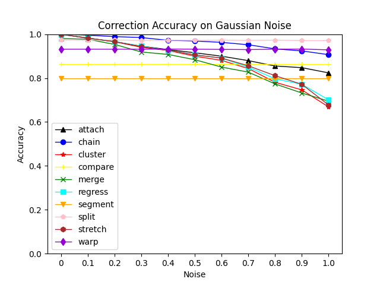
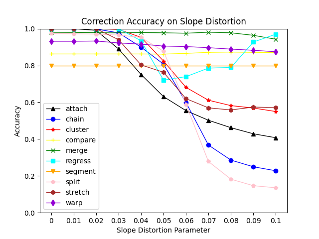
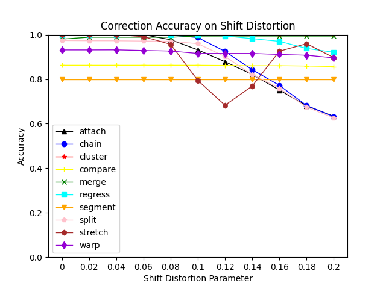
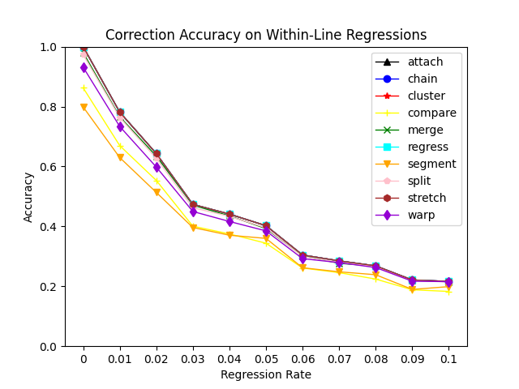
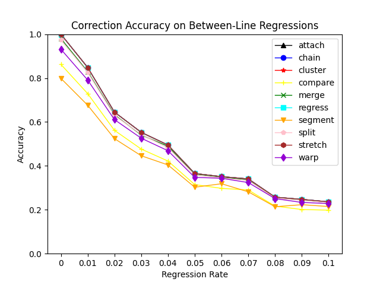

# CS421 Project 1
## Automated Eye Tracking Data Correction
### *Ben Raivel*

## Abstract:
In this project I replicated part of the paper: *Carr, Jon W., et al. "Algorithms for the automated correction of vertical drift in eye-tracking data." Behavior Research Methods 54.1 (2022): 287-310.* Using the replication package, I compared the performance of ten algorithms on five types of error: gaussian noise, slope distortion, shift distortion, within-line regression, and between-line regression.

## Results:
### Gaussian Noise:

| Algorithm | Accuracy |
|-----------|----------|
| split | 0.97 |
| chain | 0.96 |
| warp | 0.93 |
| attach | 0.91 |
| regress | 0.89 |
| stretch | 0.88 |
| cluster | 0.88 |
| compare | 0.86 |
| merge | 0.86 |
| segment | 0.80 |

### Slope Distortion:

| Algorithm | Accuracy |
|-----------|----------|
| merge | 0.97 |
| warp | 0.91 |
| regress | 0.90 |
| compare | 0.87 |
| cluster | 0.80 |
| segment | 0.80 |
| stretch | 0.76 |
| attach | 0.69 |
| chain | 0.67 |
| split | 0.64 |

### Shift Distortion:

| Algorithm | Accuracy |
|-----------|----------|
| cluster | 1.0 |
| merge | 0.99 |
| regress | 0.98 |
| warp | 0.92 |
| stretch | 0.91 |
| chain | 0.89 |
| attach | 0.88 |
| split | 0.87 |
| compare | 0.86 |
| segment | 0.80 |

### Within Line Regression:

| Algorithm | Accuracy |
|-----------|----------|
| attach | 0.46 |
| chain | 0.46 |
| cluster | 0.46 |
| regress | 0.46 |
| stretch | 0.46 |
| merge | 0.45 |
| split | 0.45 |
| warp | 0.43 |
| compare | 0.39 |
| segment | 0.38 |

### Between Line Regression:

| Algorithm | Accuracy |
|-----------|----------|
| attach | 0.49 |
| chain | 0.49 |
| cluster | 0.49 |
| regress | 0.49 |
| stretch | 0.49 |
| merge | 0.48 |
| split | 0.47 |
| warp | 0.46 |
| compare | 0.42 |
| segment | 0.40|